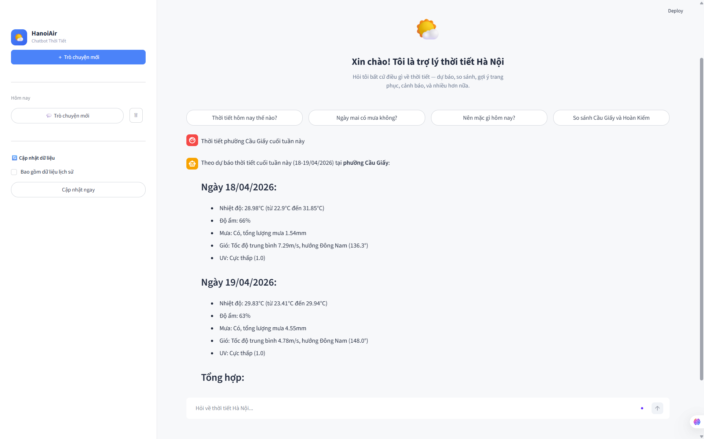
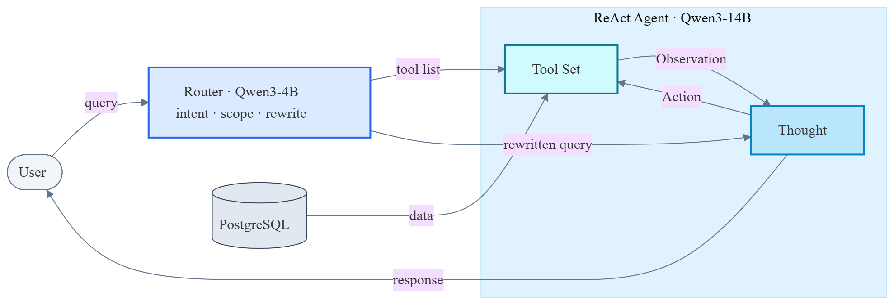

# Chatbot Hanoi Weather

Chatbot Hanoi Weather là sản phẩm khóa luận tốt nghiệp, một chatbot tư vấn thời tiết bằng tiếng Việt dành riêng cho người dân Hà Nội. Người dùng có thể đặt câu hỏi tự nhiên về thời tiết hiện tại, dự báo trong những ngày tới, so sánh giữa các khu vực, hay xin gợi ý hoạt động phù hợp, và nhận lại câu trả lời rõ ràng, dễ hiểu thay vì phải tự đọc bảng số liệu.




## Đặc điểm nổi bật

Hệ thống nhận diện được 15 nhóm câu hỏi phổ biến về thời tiết, từ tra cứu nhiệt độ và lượng mưa, dự báo theo giờ và theo ngày, đến cảnh báo rét đậm rét hại hay nhận diện hiện tượng nồm ẩm đặc trưng của Hà Nội. Dữ liệu khí tượng bao phủ toàn bộ 126 phường xã và 30 quận huyện của Hà Nội, cập nhật liên tục từ dịch vụ OpenWeather. Người dùng có thể gọi địa điểm theo tên hành chính như phường Cầu Giấy, quận Đống Đa, hoặc bằng tên thông thường quen thuộc như Hồ Gươm, Mỹ Đình, Sân bay Nội Bài.

Chatbot duy trì ngữ cảnh hội thoại qua nhiều lượt, nên người dùng có thể hỏi tiếp tự nhiên như "Còn ngày mai thì sao" hay "Ở Đống Đa có khác không" mà không cần lặp lại địa điểm hay thời gian. Mỗi câu trả lời đều dựa trên dữ liệu thực tế trong cơ sở dữ liệu, không bịa số liệu, và nếu không có thông tin phù hợp hệ thống sẽ thông báo thẳng cho người dùng.


## Kiến trúc hệ thống



Hệ thống được xây dựng theo hướng chia nhỏ nhiệm vụ cho hai mô hình ngôn ngữ nhỏ mã nguồn mở, mỗi mô hình đảm nhận một việc cụ thể thay vì dùng một mô hình lớn xử lý tất cả.

Khi người dùng gửi câu hỏi, mô hình Qwen3-4B đã được tinh chỉnh sẽ đọc câu hỏi cùng lịch sử hội thoại để hiểu người dùng đang quan tâm chủ đề gì, đang hỏi về phường nào hay quận nào, và viết lại câu hỏi thành dạng tự chứa đủ thông tin. Đầu ra của bước này là một danh sách rút gọn các công cụ phù hợp với chủ đề câu hỏi, thường từ ba đến năm công cụ, cùng câu truy vấn đã viết lại.

Sau đó, trợ lý AI sử dụng mô hình Qwen3-14B nhận danh sách công cụ rút gọn này và tiến hành lập luận theo từng bước. Trợ lý suy nghĩ về thông tin cần tìm, gọi công cụ phù hợp để lấy dữ liệu từ cơ sở dữ liệu, quan sát kết quả rồi quyết định bước tiếp theo, lặp lại cho đến khi đủ thông tin trả lời. Cuối cùng trợ lý tổng hợp dữ liệu thu được thành một câu trả lời bằng tiếng Việt tự nhiên gửi về người dùng.

Cách chia hai tầng này giúp mỗi mô hình làm tốt phần việc của mình. Mô hình nhỏ hơn lo việc đọc hiểu ý người dùng nhanh chóng, mô hình lớn hơn tập trung vào việc lập luận và tổng hợp câu trả lời. Toàn bộ dữ liệu khí tượng được lưu trong cơ sở dữ liệu PostgreSQL, đã được tổng hợp sẵn ở ba cấp phường xã, quận huyện và toàn thành phố để truy vấn nhanh.


## Yêu cầu cài đặt

Để chạy hệ thống theo phương án Docker, máy của bạn cần:

- Docker phiên bản 24.0 trở lên
- Docker Compose v2
- Kết nối internet ổn định để tải image và gọi các dịch vụ bên ngoài

Để chạy trực tiếp không qua Docker phục vụ phát triển:

- Python 3.11 trở lên
- PostgreSQL 16
- Lệnh `make` để dùng các target trong Makefile

Các khóa truy cập cần chuẩn bị sẵn:

- Khóa OpenWeather One Call API 3.0, đăng ký miễn phí tại `https://openweathermap.org/api`
- Khóa dịch vụ mô hình ngôn ngữ tương thích chuẩn OpenAI, dùng cho tầng trợ lý AI

Tài khoản Google để mở Google Colab phục vụ triển khai bộ phân loại ý định, có thể dùng GPU T4 miễn phí.


## Hướng dẫn triển khai bằng Docker

### Bước 1. Tải mã nguồn và tạo tệp cấu hình

```bash
git clone https://github.com/<username>/Chatbot_Hanoi_Weather.git
cd Chatbot_Hanoi_Weather
cp env_example.txt .env
```

Mở tệp `.env` vừa tạo, điền các giá trị sau:

- `OPENWEATHER_API_KEY_0`: khóa OpenWeather của bạn. Có thể điền thêm vào các trường `OPENWEATHER_API_KEY_1` tới `OPENWEATHER_API_KEY_4` để luân phiên nhiều khóa và tăng giới hạn gọi.
- `AGENT_API_BASE`, `AGENT_API_KEY`, `AGENT_MODEL`: thông tin dịch vụ mô hình ngôn ngữ dùng cho tầng trợ lý AI. Ngoài ra có thể điền thêm `API_BASE`, `API_KEY`, `MODEL` làm bộ khóa dự phòng cho phép tương thích ngược.
- `POSTGRES_PASSWORD`: đổi mật khẩu cơ sở dữ liệu nếu cần.
- `JWT_SECRET`: đổi sang một chuỗi ngẫu nhiên đủ dài để ký phiên hội thoại.

Các trường còn lại có giá trị mặc định, không cần đổi ở giai đoạn này.

### Bước 2. Khởi động bộ phân loại ý định trên Google Colab

Bộ phân loại ý định dùng mô hình Qwen3-4B, cần GPU để chạy. Vì không phải máy nào cũng có GPU, hệ thống triển khai bộ phân loại này trên Google Colab.

1. Mở Google Colab tại `https://colab.research.google.com`.
2. Tải tệp notebook `scripts/colab/ollama_router_colab.ipynb` lên Colab.
3. Vào Runtime, chọn Change runtime type, chọn GPU T4 rồi nhấn Save.
4. Chạy tuần tự các cell từ 1 đến 7. Lần chạy đầu tiên mất khoảng ba đến năm phút.
5. Sao chép địa chỉ web in ra ở cell 6, dạng `https://xxxx.trycloudflare.com`.
6. Quay về tệp `.env` ở máy của bạn, điền địa chỉ vừa sao chép vào trường `OLLAMA_BASE_URL`, đảm bảo `USE_SLM_ROUTER` đặt là `true`.

Hướng dẫn chi tiết hơn về Colab có trong tệp `scripts/colab/README.md`.

### Bước 3. Khởi động toàn bộ hệ thống

```bash
docker compose up -d
```

Lệnh trên sẽ dựng image, khởi động ba dịch vụ là PostgreSQL, FastAPI và Streamlit, đồng thời khởi tạo schema cơ sở dữ liệu lần đầu chạy. Quá trình build image lần đầu mất khoảng năm đến mười phút tùy tốc độ mạng.

Kiểm tra trạng thái các dịch vụ:

```bash
docker compose ps
```

Tất cả các container phải ở trạng thái `running` hoặc `healthy`.

### Bước 4. Kiểm tra hệ thống sẵn sàng

```bash
curl http://localhost:8000/ready
```

Kết quả mong đợi là tất cả các thành phần đều ở trạng thái sẵn sàng, ví dụ:

```json
{"postgres": "ok", "router": "ok", "llm": "ok"}
```

Nếu trường `router` báo `disabled`, kiểm tra lại bước 2 và bước 1 xem các biến `OLLAMA_BASE_URL`, `OLLAMA_MODEL`, `USE_SLM_ROUTER` đã được điền đúng vào tệp `.env` chưa.

### Bước 5. Mở giao diện và chạy thử

Mở trình duyệt và truy cập một trong hai địa chỉ sau:

- Giao diện chatbot: `http://localhost:8501`
- Tài liệu API: `http://localhost:8000/docs`

Một số câu hỏi gợi ý để chạy thử:

- "Thời tiết phường Cầu Giấy hôm nay thế nào"
- "Ngày mai ở quận Đống Đa có mưa không"
- "So sánh nhiệt độ giữa Cầu Giấy và Hoàn Kiếm"
- "Cuối tuần này có nên đi dạo Hồ Gươm không"

### Dừng và khởi động lại

Dừng toàn bộ hệ thống:

```bash
docker compose down
```

Dừng và xóa luôn dữ liệu cơ sở dữ liệu để cài lại từ đầu:

```bash
docker compose down -v
```

Xem log thời gian thực của một dịch vụ:

```bash
docker compose logs -f api
docker compose logs -f streamlit
```


## Chạy trực tiếp không qua Docker

Phương án này dành cho phát triển và chỉnh sửa mã nguồn. Cần cài đặt sẵn Python 3.11 và PostgreSQL 16, đồng thời tự tạo cơ sở dữ liệu `chatbothanoiair` trước khi chạy.

```bash
make install
cp env_example.txt .env
make run-all
```

Lệnh `make run-all` khởi động đồng thời tầng API trên cổng 8000 và giao diện Streamlit trên cổng 8501. Vẫn cần bật bộ phân loại ý định trên Colab như mô tả ở bước 2 phần triển khai Docker.

Nếu chỉ muốn chạy riêng từng phần, dùng:

```bash
make run-api
make run-ui
```


## Cấu trúc thư mục

```
Chatbot_Hanoi_Weather/
├── app/
│   ├── agent/          Logic trợ lý AI và các tệp prompt
│   ├── api/            Các điểm kết nối FastAPI
│   ├── ui/             Thành phần giao diện Streamlit
│   ├── dal/            Lớp truy cập cơ sở dữ liệu
│   ├── core/           Cấu hình và định nghĩa dữ liệu chung
│   ├── db/             Tập lệnh khởi tạo và di chuyển cơ sở dữ liệu
│   ├── config/         Cấu hình ứng dụng theo môi trường
│   └── scripts/        Tập lệnh nội bộ, gồm ingest dữ liệu OpenWeather
├── scripts/
│   └── colab/          Notebook triển khai bộ phân loại ý định trên Colab
├── data/
│   └── evaluation/     Bộ dữ liệu kiểm thử và kết quả đánh giá
├── experiments/        Thực nghiệm và báo cáo hiệu chỉnh
├── training/           Notebook huấn luyện mô hình Qwen3-4B
├── tests/              Bộ kiểm thử tự động pytest
├── images/             Hình minh họa dùng trong readme
├── app.py              Điểm vào giao diện Streamlit
├── Dockerfile          Định nghĩa image ứng dụng
├── docker-compose.yml  Cấu hình ba dịch vụ chạy đồng thời
├── entrypoint_api.sh   Tập lệnh khởi động dịch vụ API
├── entrypoint_streamlit.sh   Tập lệnh khởi động giao diện Streamlit
├── init.sql            Tập lệnh khởi tạo cơ sở dữ liệu lần đầu
├── requirements.txt    Danh sách gói Python phụ thuộc
├── Makefile            Tập hợp các lệnh tiện ích thường dùng
└── env_example.txt     Tệp mẫu liệt kê các biến môi trường cần thiết
```


## Bảng biến môi trường

Danh sách đầy đủ ở tệp `env_example.txt`. Các biến quan trọng nhất:

| Biến | Bắt buộc | Ý nghĩa |
|---|---|---|
| `AGENT_API_BASE` | Có | Địa chỉ điểm kết nối của dịch vụ mô hình ngôn ngữ cho tầng trợ lý AI |
| `AGENT_API_KEY` | Có | Khóa truy cập dịch vụ mô hình ngôn ngữ của trợ lý AI |
| `AGENT_MODEL` | Có | Tên mô hình cho trợ lý AI, mặc định `qwen3-14b` |
| `API_BASE`, `API_KEY`, `MODEL` | Có | Bộ khóa dự phòng cho phép tương thích ngược, dùng khi các biến `AGENT_*` không được set |
| `OPENWEATHER_API_KEY_0` | Có | Khóa OpenWeather, có thể thêm tới `_4` để luân phiên |
| `POSTGRES_PASSWORD` | Có | Mật khẩu cơ sở dữ liệu PostgreSQL |
| `DATABASE_URL` | Có | Chuỗi kết nối tới cơ sở dữ liệu, dùng khi chạy không qua Docker |
| `OLLAMA_BASE_URL` | Có | Địa chỉ web của bộ phân loại ý định trên Colab |
| `OLLAMA_MODEL` | Có | Tên mô hình bộ phân loại, mặc định `hanoi-weather-router` |
| `USE_SLM_ROUTER` | Có | Đặt là `true` để bật bộ phân loại ý định |
| `SLM_CONFIDENCE_THRESHOLD` | Không | Ngưỡng tin cậy của bộ phân loại, mặc định `0.75` |
| `JWT_SECRET` | Có | Khóa bí mật ký JWT cho phiên hội thoại |
| `LANGCHAIN_TRACING_V2` | Không | Bật theo dõi qua dịch vụ LangSmith, mặc định tắt |
| `JUDGE_*`, `QWEN_*`, `OPENAI_COMPAT_*` | Không | Chỉ cần khi chạy bộ đánh giá tự động trong `experiments/evaluation` |


## Kiểm thử

Bộ kiểm thử tự động viết bằng pytest, bao gồm kiểm thử tầng dữ liệu, logic của trợ lý AI và bộ phân loại ý định, các điểm kết nối API.

```bash
make test
```

